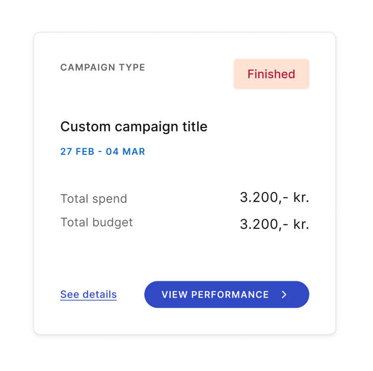

# AngularJS boilerplate

This project contains very basic setup of an AngularJS app for implementing frontend challenges.


## Getting Started

To get you started simply clone the repository and install the dependencies:

```
npm install
```

Once you have installed the dependencies you can start the local development environment with: 

```
npm start
```


Once started navigate to the app at [`http://localhost:8000`](http://localhost:8000).


# Challenge - The weather forecast app

Using the free [Open Meteo API](https://open-meteo.com/en/docs) service, build a simple weather forecast UI that displays temperature and rain forecast for a selected location.

It is up to you whether you want to focus more on backend or frontend, but we do not expect you to spend more than 4 hours on this task. Do not hesitate to contact us if you have any questions.

Submitting the solution - please create a new public repository on your own account (bitbucket or github) and send the link back to us.

## Backend requirements
- Setup bare minimum Express server (Node JS)
- Expose a single endpoint that will be called by the frontend app. It should integrate with Open Meteo API and return forecast for given location, here is an example of forecast request for Copenhagen - https://open-meteo.com/en/docs#latitude=55.6759&longitude=12.5655&hourly=temperature_2m,rain&daily=&timezone=auto

## Frontend requirements:
- Implement input field for entering location, e.g. Copenhagen
- Send the location to your new backend API and receive forecast data back.
- Implement the card design for displaying rain and temperature forecast for the location, card styling example is shown below.
- Buttons in the bottom of the card can be disregarded or used for more advanced weather forecast features.



